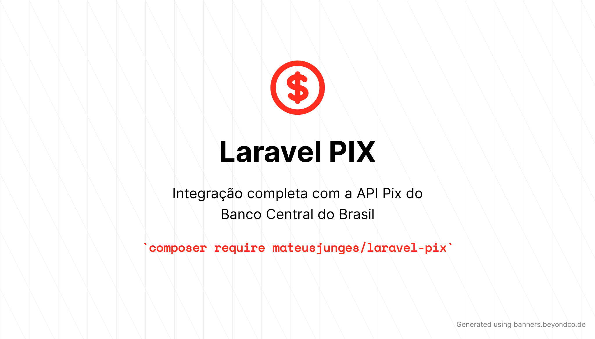

# Laravel PIX



> Work In Progress

Este pacote oferece integração completa com a API PIX do banco central do Brasil.

# Instalação
Você pode instalar este pacote utilizando o composer:
```bash
composer require mateusjunges/laravel-pix
```

Agora, é necessário publicar os assets utilizados e o arquivo de configuração do pacote.

## Publicando os assets

Para publicar os assets deste pacote para a pasta public do seu projeto, utilize o comando
```bash
php artisan vendor:publish --tag=laravel-pix-assets
```

## Publicando o arquivo de configuração

Para publicar o arquivo de configuração, execute o comando abaixo:

```bash
php artisan vendor:publish --tag=laravel-pix-config
```

Este comando vai copiar o arquivo `laravel-pix.php` para sua pasta config, com o seguinte conteúdo:

```php
<?php

return [

    'transaction_currency_code' => 986,

    'country_code' => 'BR',

    /*
     | O PIX precisa definir seu GUI (Global Unique Identifier) para ser utilizado.
     */
    'gui' => 'br.gov.bcb.pix',

    'country_phone_prefix' => '+55',

    /*
     * Tamanho do QR code quer será gerado pelo gerador implementado no pacote, em pixels.
     */
    'qr_code_size' => 200,

    /*
     * Você pode definir um middleware para proteger a rota disponibilizada para gerar QR codes.
     * O nome registrado para este middleware precisa ser definido aqui.
     */
    'create_qr_code_route_middleware' => '',

    /*
     * Informações do Prestador de serviço de pagamento (PSP) que você está utilizando.
     * base_url: URL base da API do seu PSP.
     * oauth_bearer_token: Você pode definir o seu Token
     */
    'psp' => [
        'base_url' => env('LARAVEL_PIX_PSP_BASE_URL'),
        'oauth_token_url' => env('LARAVEL_PIX_PSP_OAUTH_URL', false),
        'oauth_bearer_token' => env('LARAVEL_PIX_OAUTH2_BEARER_TOKEN'),
        'ssl_certificate' => env('LARAVEL_PIX_PSP_SSL_CERTIFICATE'),
        'client_secret' => env('LARAVEL_PIX_PSP_CLIENT_SECRET'),
        'client_id' => env('LARAVEL_PIX_PSP_CLIENT_ID'),
    ]
];
```

# Endpoints
Os endpoints disponibilizados por este pacote são os mesmos implementados pelo Banco Central, e [documentados aqui][doc_bacen].
Entretanto, o seu provedor de serviços de pagamento (PSP) pode não implementar todos eles.

A lista de endpoints completa está descrita aqui:

- Cob (Reúne endpoints destinados a lidar com gerenciamento de cobranças imediatas)
    - `PUT` `/cob/{txid}`: Cria uma cobrança imediata.
    - `PATCH` `/cob/{txid}`: Revisar uma cobrança imediata.
    - `GET` `/cob/{txid}`: Consultar uma cobrança imediata.
    - `POST` `/cob`: Cria uma cobrança imediata com id de transação definido pelo PSP.
    - `GET` `/cob`: Consultar lista de cobranças imediatas.

- CobV (Reúne endpoints destinados a lidar com gerenciamento de cobranças com vencimento.)
    - `PUT` `/cobv/{txid}`: Cria uma cobrança com vencimento.
    - `PATCH` `/cobv/{txid}`: Revisar uma cobrança com vencimento.
    - `GET` `/cobv/{txid}`: Consultar uma cobrança com vencimento.
    - `GET` `/cobv`: Consultar lista de cobranças com vencimento.

- LoteCobV (Reúne endpoints destinados a lidar com gerenciamento de cobranças com vencimento em lote.)
    - `PUT` `/lotecobv/{id}`: Criar/Alterar lote de cobranças com vencimento.
    - `PATCH` `/lotecobv/{id}`: Utilizado para revisar cobranças específicas dentro de um lote de cobranças com vencimento.
    - `GET` `/lotecobv/{id}`: Utilizado para consultar um lote específico de cobranças com vencimento.
    - `GET` `/lotecobv`: Consultar lotes de cobranças com vencimento.

- PayloadLocation (Reúne endpoints destinados a lidar com configuração e remoção de locations para uso dos payloads)
    - `POST` `/loc`: Criar location do payload.
    - `GET` `/loc`: Consultar locations cadastradas.
    - `GET` `/loc/{id}`: Recuperar location do payload.
    - `DELETE` `/loc/{id}/{txid}`: Desvincular uma cobrança de uma location.

- Pix (Reúne endpoints destinados a lidar com gerenciamento de Pix recebidos.)
    - `GET` `/pix/{e2eid}`: Consultar Pix.
    - `GET` `/pix`: Consultar pix recebidos.
    - `PUT` `/pix/{e2eid}/devolucao/{id}`: Solicitar devolucão.
    - `GET` `/pix/{e2eid}/devolucao/{id}`: Consultar devolução.

- Webhook (Reúne endpoints para gerenciamento de notificações por parte do PSP recebedor ao usuário recebedor.)
    - `PUT` `/webhook/{chave}`: Configurar o webhook pix.
    - `GET` `/webhook/{chave}`: Exibir informações acerca do webhook pix.
    - `DELETE` `/webhook/{chave}`: Cancelar o webhook pix.
    - `GET` `/webhook`: Consultar webhooks cadastrados.

[doc_bacen]: https://bacen.github.io/pix-api/index.html#/